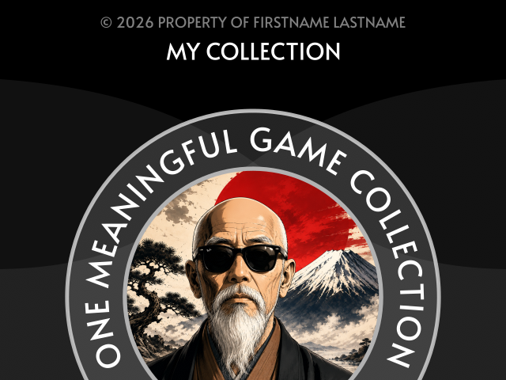
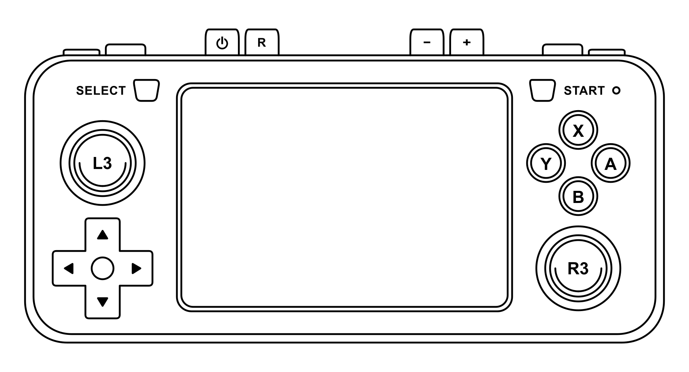

# One Meaningful Game

### Turn Your R36S/R36H Into a Dedicated Single-Game Console

One Meaningful Game (OMG) is a custom setup for dArkOS that turns your R36S/R36H into a console focused on **one main game**.

The idea is simple: instead of constantly browsing a huge library, you choose one game to experience properly, while keeping a few side games available for occasional play.

<div align="center">

### This project is a gaming meditation.



</div>

## How it works

You create an **OMG collection** containing:

- one main game;
- optionally, two or three side games;
- optionally, a custom boot logo;
- optionally, a custom low-battery image;
- the RetroArch configuration required by the collection.

The collection can contain games from different systems and cores.

- **First boot:** your main game is launched.
- **Each subsequent reboot:** one of the optional side games is selected sequentially.

Only one collection can be installed at a time, but you can create as many collections as you like.

---

## Build your collection

1. Download the content of this project.

2. Rename:

   ```text
   EASYROMS/omg-collection/collection-name
   ```

to your chosen collection name, for example:

   ```text
   EASYROMS/omg-collection/my-collection
   ```

3. Put your main game inside:

   ```text
   roms/<core>/
   ```

   The folder name must match the RetroArch core library name **without** `_libretro.so`.

   For example:

   | ROM folder            | RetroArch core              |
      | --------------------- | --------------------------- |
   | `roms/snes9x/`        | `snes9x_libretro.so`        |
   | `roms/gambatte/`      | `gambatte_libretro.so`      |
   | `roms/fbneo/`         | `fbneo_libretro.so`         |
   | `roms/mame2003_plus/` | `mame2003_plus_libretro.so` |

   Any installed RetroArch core can be used without changing the scripts.

   The launcher currently supports `.zip` and `.ZIP` files, so the main game must be playable from a ZIP archive using the selected core.

   Required BIOS files and other core resources must also be present on the console.

   For compatibility with older collections, `mame2003` also selects `mame2003_plus_libretro.so`.

4. Edit:

   ```text
   BOOT/omg/config/omg.cfg
   ```

   and set:

   ```text
   install_collection=my-collection
   ```

5. **Optional:** add side games to:

   ```text
   roms/<core>/random/
   ```

   The core is determined by the folder containing `random`, so side games can use different cores from the main game.

6. **Optional:** add a collection cover for the boot screen.

   Use a:

   * 640×480 image
   * 24-bit RGB
   * Windows Bitmap (`.bmp`)

> [!NOTE]
> You can use GIMP to convert and export any image in this format.

   Save it as:

   ```text
   EASYROMS/omg-collection/my-collection/logo.bmp
   ```

   The file is installed as:

   ```text
   /boot/logo.bmp
   ```

7. **Optional:** add a custom low-battery image.

   Use a:

   * 640×480 image
   * 24-bit RGB
   * Windows Bitmap (`.bmp`)

   Save it as:

   ```text
   EASYROMS/omg-collection/my-collection/low_battery.bmp
   ```

   If present, the image is installed as:

   ```text
   /boot/low_battery.bmp
   ```

   The original dArkOS image is backed up as:

   ```text
   /boot/low_battery-backup.bmp
   ```

   If `low_battery.bmp` is not included in the collection, the existing system image is left unchanged.

8. **RetroArch configuration:**

   The collection configuration is stored in:

   ```text
   BOOT/omg/config/
   ```

   Everything inside this directory is copied to:

   ```text
   /roms/omg/config/
   ```

   This includes the RetroArch configuration and core options.

   For example:

   ```text
   BOOT/omg/config/
   ├── omg.cfg
   ├── retroarch.cfg
   └── retroarch-core-options.cfg
   ```

   The `retroarch.cfg` and core options are easily customizable with any text editor from any computer.

---

# Installation

OMG works with:

* [dArkOSRE-R36](https://github.com/southoz/dArkOSRE-R36)
* [dArkOSen-R36S](https://github.com/djparentx/dArkOSen-R36S)

The installation procedure is the same for both.

> [!WARNING]
> **OMG is an amateur project. Use it at your own risk.**
>
> Install it on a **fresh dArkOS installation only**. It is not intended to be installed on an existing dArkOS SD card.

> [!IMPORTANT]
> **OMG's `BOOT` files must be copied to the SD card BEFORE the first dArkOS boot.**
>
> If dArkOS has already been booted, reflash the SD card and start again.
>
> The `EASYROMS/omg-collection/` folder is copied later during the installation.

> [!WARNING]
> **OMG changes dArkOS to run as a One Meaningful Game console.**
>
> Once installation is complete, reverting to the standard dArkOS setup is not straightforward.

### 1. Flash dArkOS

Download the latest release of either:

* [dArkOSRE-R36](https://github.com/southoz/dArkOSRE-R36/releases)
* [dArkOSen-R36S](https://github.com/djparentx/dArkOSen-R36S/releases)

Flash it to your SD card following the instructions for your chosen firmware.

**Do not boot the console yet.**

### 2. Copy OMG to the BOOT partition

**Before the first boot**, copy the contents of OMG's:

```text
BOOT/
```

to the SD card's:

```text
BOOT/
```

partition.

Overwrite the existing:

```text
expandtoexfat.sh
```

file.

### 3. First boot

Insert the SD card and boot the console.

dArkOS and OMG will be installed automatically. The console may reboot several times.

Eventually you should see a message asking you to copy the OMG collection:

```text
============================================================

                     ONE MEANINGFUL GAME

    Copy the '/EASYROMS/omg-collection' to the EASYROMS partition

                             &

                     Reboot the system

============================================================
```

A blank or apparently frozen screen at this stage can also be normal.

### 4. Copy your collection

Switch off the console.

If necessary, hold the power button for approximately 10 seconds.

Remove the SD card and connect it to your PC.

Copy:

```text
EASYROMS/omg-collection/
```

to the SD card's:

```text
EASYROMS/
```

partition.

### 5. Finish the installation

Put the SD card back into the console and boot it again.

OMG will install the selected collection and reboot the console.

Your **One Meaningful Game** setup should now be ready.

---

## Have Fun :)

**Play less. Play meaningfully.**


